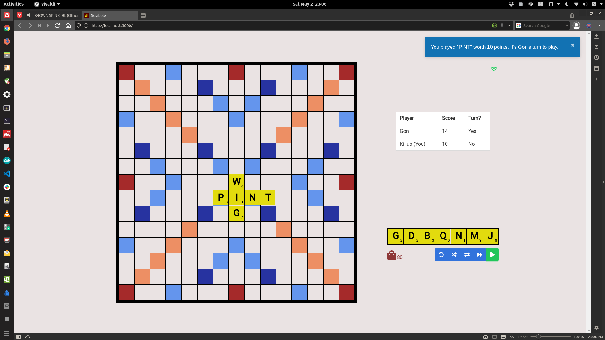

## Scrabble
Play scrabble with friends on your local network

* Still in dev.
* Please see the [DevFlow](DevFlow.md) file for issues I'm fixing.

**You'll need to checkout the `uat` branch to test. Please note that the gameplay itself is still in develpoment**

## Sneak-Peak
Here's a sneak-peak, nonetheless

## UAT Testing
- Checkout the `uat` branch: `git checkout uat`
- To test, You'll need Python3.6+ installed on your computer.
- Create a virtual environment, activate it, and install the requirements: `pip3 install -r requirements.txt`. 
- At the root folder, in the virtual environment, simply run `python3 wsgi.py`.
- `Navigate to your local IP address (192.168...:5005) to view the app. 
- Please **DO NOT RUN ON LOCALHOST. IF YOU DO, YOU'LL RUN INTO ISSUES. IT HAS TO BE THE LOCAL [PRIVATE] IP ADDRESS (e.g `http://192.168.0.169:5005`) OF YOUR SYSTEM, NOT `http://localhost:5005`. OTHER SYSTEMS (PLAYERS) WON'T BE ABLE TO CONNECT TO THE APP, IF YOU RUN IT ON LOCALHOST.** 
- Host a game session and then connect other systems (players) to start the scrabble game
