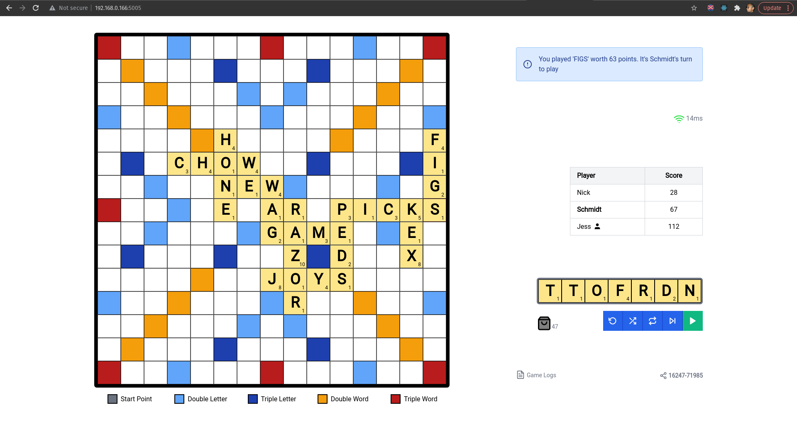

## Scrabble
A strictly multi-player Scrabble game that allows gameplay between people on a network. The game is based on [Hasbro's Scrabble](https://scrabble.hasbro.com/en-us), and uses a Scrabble words database from 2018.

### Extra Features
- Time to play: Game host can configure a time within which each player must play before the turn is automatically skipped.
- Push to Talk: Allows players talk to each other via PTT audio. Only works over HTTPS due to security policies.
- 3-Try-Validation: Each player has at most three tries to play a valid word (since challenging plays isn't possible), before which the turn is automatically skipped.
- Game Logs: See history of in-game plays.

### Requirements
- A laptop, or any device that allows dragging web elements with a mouse.
- Please note that development was tailored specifically towards laptops/desktops, as they fully support the [HTML5 Draggable](https://developer.mozilla.org/en-US/docs/Web/API/HTML_Drag_and_Drop_API) API, unlike mobile devices or tablets.
- Err...just use a laptop and adjust the zoom as needed. See the Known Issues section below for zoom issues.
- Python 3.6+

### Usage
To play the game, you're either the **host** or not (a mere **player**). 

The host is the person who, well, hosts a game session to which other players connect to using the host's **Session ID**.
 The following instructions are meant for the host, as [s]he has to host the server on which the game would run.

#### Dependency Installation
As a host, you need the following:
- A Python virtual environment. If you don't already know how to create one, see [here](https://realpython.com/lessons/creating-virtual-environment/).
- Pipenv: In the activated virtual environment, simply run `pip3 install pipenv`.

#### Game Procedure
 To host a game session:

- Clone and checkout this `master` branch; or alternatively, simply download it as a zip file.
- Ensure the virtual environment is activated. Then, using `pipenv`, install the game's requirements: `pipenv install`.
- When that's done, simply run `pipenv run python3 wsgi.py`. This starts the game server.
- By default, the application tries to get your local private IP address (not `localhost`) to run on. However, if you're using a VPN or are on a weird network, it may get it wrong. Feel free to modify the `host` variable in the `wsgi.py` file to your actual local private IP address. The only caveat is that you have to host the app on the private IP address and not `localhost`. This is in order to allow other players on your network to visit the application. 
- Modify firewall permissions to allow incoming traffic from port `5005`.
- Navigate to your local private IP address (`192.168...:5005`) and get playing. 
- Host a game session. During this, a Game ID would be automatically generated for you. Share this with the people you want to play with.

### Sneak-Peak
Gameplay sneak-peak

### Known Issues / Ongoing Bug Fixes
- Certain in-rack drags of pieces cause them to disappear. Only happens if it's not your turn to play.
- The final scoring pipeline hasn't been updated to add the scores of other players to the player who emptied his/her rack to end the game.
- Zoom needs to be adjusted (reduced or increased) to get proper game layout. This isn't anything but my poor CSS skills. I should fix this soon
- Game cannot be resumed, so do not refresh your page once the game starts. I'm currently working on adding this feature.

### Collaborations and Development
- Development is done in the `dev` branch: `git checkout dev`. Current issues are in the `DevFlow.md` file.
